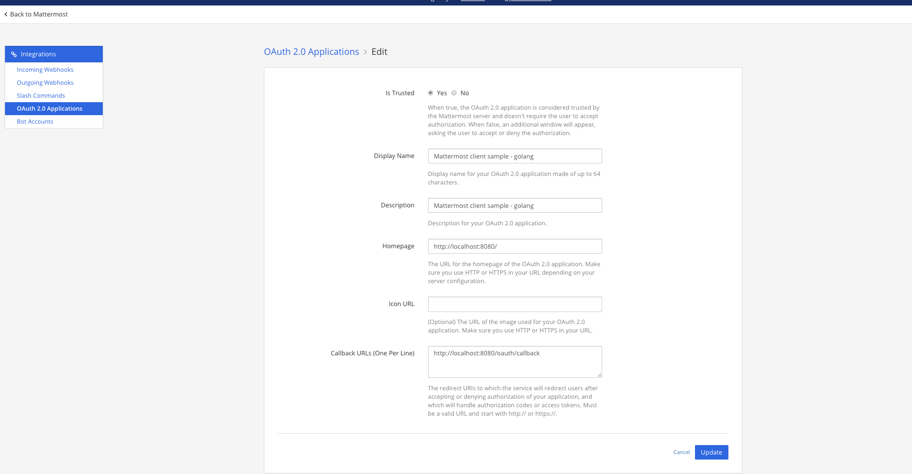
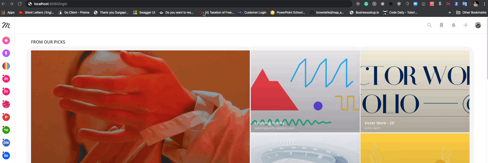

# Mattermost OAuth2 Client Sample Application - Golang

## Overview

Mattermost 3.3 and later includes an **OAuth2 Service Provider**, enabling users with an account on a Mattermost server to sign-in to 3rd party applications. 

This sample application, created in Golang, demonstrates how an OAuth2 client can be used with the Mattermost OAuth2 Service Provider.

## Setup Server Environment

1. Start a Mattermost Server cloned from [master](https://github.com/mattermost/platform)
2. Create an account and a team
3. Go To **System Console -> Integrations -> OAuth2 Provider** and enable the service
4. Go back to the team you created and from the **Main Menu** select **Integrations**
5. Add a new OAuth2 App, with `http://localhost:8080/oauth/callback` as the callback URL



## Setup Sample App Dev Environment
1. Clone the Github repository to run the sample
```
  git clone https://github.com/Durgaprasad-Budhwani/mattermost-oauth2-client-sample-golang.git
  cd mattermost-oauth2-client-sample-golang
```

2. Setup the configuration according to your server an OAuth2 App
    - mattermostURL: this is the url of your mattermost instance (eg. http://localhost:8065)
    - ClientID: the client_id of the OAuth2 App that you created
    - ClientSecret: the client_secret of the OAuth2 App that you created
   

3. Once you have configured the app you can run it by issuing
```
go run main.go
```

## Demo

Open browser with URL [http://localhost:8080/login](http://localhost:8080/login)


